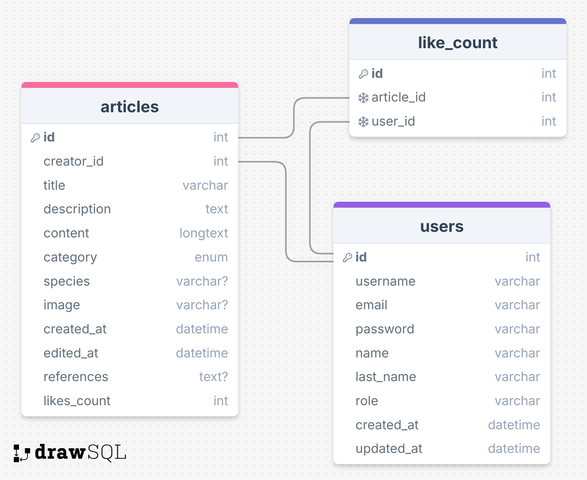

# 🌊 Código Abisal - API REST

<div align="center">


**API REST profesional para la gestión de artículos sobre las profundidades oceánicas**

[Características](#-características) •
[Instalación](#-instalación) •
[Configuración](#️-configuración) •
[API](#-endpoints-principales) •
[Despliegue](#-despliegue)

</div>

---

## 📋 Descripción

**Código Abisal** es una API REST robusta y escalable diseñada para gestionar artículos científicos y divulgativos sobre las profundidades del océano. El proyecto permite crear, editar, eliminar y consultar contenido sobre fauna abisal, ecosistemas marinos, exploraciones oceánicas y conservación.



### 🎯 Objetivo del Proyecto

Proporcionar una plataforma backend completa para compartir conocimiento sobre el mundo abisal, con un sistema de autenticación seguro, gestión de usuarios y un sistema de "likes" para artículos populares.

---

## ✨ Características

### 🔐 Autenticación y Autorización
- ✅ Registro de usuarios con hash de contraseñas (bcrypt)
- ✅ Login con JWT (JSON Web Tokens)
- ✅ Middleware de autenticación y roles (user/admin)
- ✅ Sistema de recuperación de contraseña con tokens temporales

### 📰 Gestión de Artículos
- ✅ CRUD completo de artículos (Create, Read, Update, Delete)
- ✅ Categorías especializadas: Fauna Abisal, Ecosistemas, Exploración, Conservación
- ✅ Sistema de likes por usuario
- ✅ Asignación automática de creador (creator_id)
- ✅ Validaciones robustas con express-validator

### 👥 Gestión de Usuarios
- ✅ Panel de administración de usuarios (solo admins)
- ✅ Actualización de perfiles
- ✅ Protección contra auto-eliminación
- ✅ Consulta pública de perfiles de usuario

### 🛡️ Seguridad
- ✅ Conexión TLS/SSL a base de datos (compatible con TiDB Cloud)
- ✅ Variables de entorno separadas para desarrollo/producción/test
- ✅ Validación de entrada exhaustiva
- ✅ Protección contra ataques comunes (SQL injection, XSS)

### 🧪 Testing
- ✅ Suite de tests con Jest y Supertest
- ✅ Tests unitarios e integración
- ✅ Base de datos de prueba aislada
- ✅ Cobertura completa de endpoints críticos

---

## 🚀 Tecnologías

| Categoría | Tecnologías |
|-----------|------------|
| **Runtime** | Node.js 20+ |
| **Lenguaje** | TypeScript 5.9 |
| **Framework** | Express 5.1 |
| **Base de Datos** | MySQL 8.0 / TiDB Cloud |
| **ORM** | Sequelize 6.37 |
| **Autenticación** | JWT, bcryptjs |
| **Validación** | express-validator |
| **Testing** | Jest, Supertest, ts-jest |
| **DevOps** | Docker, GitHub Actions |

---

## 📦 Instalación

### Prerrequisitos

```bash
Node.js >= 20.0.0
npm >= 10.0.0
MySQL >= 8.0 o TiDB Cloud
```

### Pasos de Instalación

1️⃣ **Clonar el repositorio**

```bash
git clone https://github.com/Codigo-Inmersion/codigo-abisal-server.git
cd codigo-abisal-server
```

2️⃣ **Instalar dependencias**

```bash
npm install
```

3️⃣ **Configurar variables de entorno**

```bash
cp .env.example .env
```

Edita el archivo `.env` con tus credenciales (ver sección [Configuración](#️-configuración))

4️⃣ **Ejecutar migraciones (automático al iniciar)**

```bash
npm run dev
```

5️⃣ **Ejecutar tests (opcional)**

```bash
npm test
```

---

## ⚙️ Configuración

### Variables de Entorno

Crea un archivo `.env` en la raíz del proyecto con las siguientes variables:

```env
# Base de Datos
DB_NAME=tu_base_de_datos
DB_USER=tu_usuario
DB_PASS=tu_contraseña
DB_HOST=tu_host
DB_PORT=3306
DB_DIALECT=mysql

# TLS/SSL (opcional, para TiDB Cloud)
DB_SSL=true
DB_SSL_CA_PATH=./certs/tidb-ca.pem

# Servidor
PORT=8000
CORS_ORIGIN=http://localhost:5173

# JWT
JWT_SECRET=tu_clave_secreta_muy_segura
JWT_EXPIRES=7d

# Frontend (para recuperación de contraseña)
FRONTEND_URL=http://localhost:5173
```

### Base de Datos de Pruebas

Crea un archivo `.env.test` para tests:

```env
NODE_ENV=test
DB_NAME=abisal_app_test
DB_USER=tu_usuario
DB_PASS=tu_contraseña
DB_HOST=localhost
DB_PORT=3306
DB_DIALECT=mysql
DB_SSL=false

PORT=8001
CORS_ORIGIN=*
JWT_SECRET=test_secret_key
JWT_EXPIRES=1h
```

---

## 🔌 Endpoints Principales

### Base URL
```
http://localhost:8000
```

### 🔐 Autenticación

| Método | Endpoint | Descripción | Auth |
|--------|----------|-------------|------|
| `POST` | `/auth/register` | Registrar nuevo usuario | ❌ |
| `POST` | `/auth/login` | Iniciar sesión | ❌ |
| `POST` | `/auth/forgot-password` | Solicitar recuperación | ❌ |
| `POST` | `/auth/reset-password` | Restablecer contraseña | ❌ |

#### Ejemplo: Registro

```bash
POST /auth/register
Content-Type: application/json

{
  "username": "oceanexplorer",
  "name": "María",
  "last_name": "González",
  "email": "maria@example.com",
  "password": "SecurePass123!"
}
```

**Respuesta:**
```json
{
  "message": "Usuario registrado exitosamente",
  "token": "eyJhbGciOiJIUzI1NiIsInR5cCI6IkpXVCJ9..."
}
```

---

### 📰 Artículos

| Método | Endpoint | Descripción | Auth |
|--------|----------|-------------|------|
| `GET` | `/article` | Listar todos los artículos | ❌ |
| `GET` | `/article/:id` | Obtener artículo específico | ❌ |
| `POST` | `/article` | Crear artículo | ✅ User/Admin |
| `PUT` | `/article/:id` | Actualizar artículo | ✅User /Admin |
| `DELETE` | `/article/:id` | Eliminar artículo | ✅ Admin |
| `POST` | `/article/:id/like` | Dar like | ✅ User/Admin |
| `DELETE` | `/article/:id/like` | Quitar like | ✅ User/Admin |

#### Ejemplo: Crear Artículo

```bash
POST /article
Authorization: Bearer {token}
Content-Type: application/json

{
  "title": "El Pez Abisal Más Profundo del Mundo",
  "description": "Descubrimiento de una nueva especie a 8,178 metros",
  "content": "En las profundidades de la Fosa de las Marianas...",
  "category": "Fauna Abisal",
  "species": "Pseudoliparis swirei",
  "image": "https://example.com/pez-abisal.jpg",
  "references": "Nature Magazine 2023"
}
```

**Respuesta:**
```json
{
  "id": 42,
  "title": "El Pez Abisal Más Profundo del Mundo",
  "description": "Descubrimiento de una nueva especie a 8,178 metros",
  "content": "En las profundidades de la Fosa de las Marianas...",
  "category": "Fauna Abisal",
  "species": "Pseudoliparis swirei",
  "image": "https://example.com/pez-abisal.jpg",
  "references": "Nature Magazine 2023",
  "creator_id": 1,
  "likes": 0,
  "created_at": "2025-01-15T10:30:00.000Z",
  "updated_at": "2025-01-15T10:30:00.000Z"
}
```

---

### 👥 Usuarios

| Método | Endpoint | Descripción | Auth |
|--------|----------|-------------|------|
| `GET` | `/users` | Listar todos los usuarios | ✅ Admin |
| `GET` | `/users/user/:id` | Perfil público de usuario | ❌ |
| `PUT` | `/users/:id` | Actualizar usuario | ✅ Admin |
| `DELETE` | `/users/:id` | Eliminar usuario | ✅ Admin |

---

## 🧪 Testing


### Ejecutar Tests

```bash
# Todos los tests
npm test

# Tests en modo watch
npm test -- --watch

# Tests con cobertura
npm test -- --coverage
```

### Estructura de Tests

```
test/
├── auth.test.ts          # Tests de autenticación
├── article.test.ts       # Tests de artículos
└── jest.setup.ts         # Configuración de Jest
```

### Descargar colección:
[](https://documenter.getpostman.com/view/46421313/2sB3QNp8Mg)

### Cobertura Actual

- ✅ Registro y login de usuarios
- ✅ CRUD completo de artículos
- ✅ Validaciones de entrada
- ✅ Autorización y roles

---

## 🐳 Docker

### Construcción de Imagen

```bash
docker build -t codigo-abisal-api .
```

### Ejecución con Docker Compose

```bash
docker-compose up -d
```

El archivo `docker-compose.yml` ya está configurado para usar la imagen de Docker Hub:

```yaml
services:
  api:
    image: gema284/codigo-abisal-server-api:dev
    container_name: abisal-api
    platform: linux/amd64
    env_file: .env.docker
    ports:
      - "8000:8000"
```

---

## 🚀 Despliegue

### Render (Recomendado)

1️⃣ **Conecta tu repositorio de GitHub**

2️⃣ **Configura las variables de entorno** en el dashboard de Render

3️⃣ **Build Command:**
```bash
npm install && npm run build
```

4️⃣ **Start Command:**
```bash
npm start
```

### Railway / Heroku

Similar a Render, asegúrate de:
- Configurar todas las variables de entorno
- Establecer `NODE_ENV=production`
- Configurar `DB_SSL=true` si usas TiDB Cloud

---

## 📁 Estructura del Proyecto

```
codigo-abisal-server/
├── src/
│   ├── controllers/         # Lógica de negocio
│   │   ├── ArticleController.ts
│   │   ├── AuthController.ts
│   │   ├── UserController.ts
│   │   └── PasswordResetController.ts
│   ├── middlewares/         # Middlewares personalizados
│   │   ├── authMiddlewares.ts
│   │   └── handleValidation.ts
│   ├── models/             # Modelos de Sequelize
│   │   ├── ArticleModel.ts
│   │   ├── UserModel.ts
│   │   └── PasswordResetToken.ts
│   ├── routes/             # Definición de rutas
│   │   ├── articleRoutes.ts
│   │   ├── authRoutes.ts
│   │   ├── userRoutes.ts
│   │   └── passwordReset.routes.ts
│   ├── validators/         # Validaciones con express-validator
│   │   ├── articleValidators.ts
│   │   ├── userValidators.ts
│   │   └── passwordResetValidators.ts
│   ├── utils/              # Utilidades
│   │   ├── jwt.ts
│   │   └── resetToken.ts
│   ├── database/           # Configuración DB
│   │   └── db_connection.ts
│   ├── interface/          # Interfaces TypeScript
│   │   ├── articleInterface.ts
│   │   └── userInterface.ts
│   └── app.ts              # Punto de entrada
├── test/                   # Tests
│   ├── auth.test.ts
│   ├── article.test.ts
│   └── jest.setup.ts
├── certs/                  # Certificados TLS
│   └── tidb-ca.pem
├── .github/workflows/      # CI/CD
│   └── docker-publish.yml
├── Dockerfile
├── docker-compose.yml
├── tsconfig.json
├── jest.config.mjs
├── package.json
└── README.md
```

---

## 🔒 Seguridad

### Buenas Prácticas Implementadas

✅ **Hashing de contraseñas** con bcrypt (10 rounds)  
✅ **Tokens JWT** con expiración configurable  
✅ **Validación exhaustiva** de entrada con express-validator  
✅ **Conexión TLS/SSL** a base de datos en producción  
✅ **CORS configurado** para dominios permitidos  
✅ **Variables de entorno** nunca comiteadas  
✅ **Middleware de autorización** por roles  
✅ **Normalización de emails** (lowercase, trim)  
✅ **Protección contra auto-eliminación** de usuarios admin

### Recomendaciones Adicionales

- 🔄 Rotar `JWT_SECRET` periódicamente
- 🚫 No exponer `PORT` públicamente sin proxy reverso
- 📝 Implementar rate limiting (ej: express-rate-limit)
- 📊 Monitorear logs en producción
- 🛡️ Usar Helmet.js para headers de seguridad

---

## 📝 Scripts Disponibles

```bash
# Desarrollo con recarga automática
npm run dev

# Compilar TypeScript a JavaScript
npm run build

# Ejecutar en producción
npm start

# Ejecutar tests
npm test
```

---

## 🤝 Contribuciones

Las contribuciones son bienvenidas. Por favor:

1. Fork el proyecto
2. Crea una rama para tu feature (`git checkout -b feature/AmazingFeature`)
3. Commit tus cambios (`git commit -m 'Add: AmazingFeature'`)
4. Push a la rama (`git push origin feature/AmazingFeature`)
5. Abre un Pull Request

---

## 👩🏽‍🏫👩🏻‍🏫👩🏼‍🏫👩🏾‍🏫👩🏽‍🏫 Equipo de Desarrollo

| Desarrolladora | GitHub | LinkedIn |
|----------------|--------|----------|
| **Camila Arenas** | [GitHub](https://github.com/mcarenashd) | [LinkedIn](https://www.linkedin.com/in/mcarenash) |
| **Gema Yébenes** | [GitHub](https://github.com/gemayc) | [LinkedIn](https://www.linkedin.com/in/gema-yebenes-83b6a6100/) |
| **Mariana Moreno** | [GitHub](https://github.com/MarianaMH1195) | [LinkedIn](https://www.linkedin.com/in/mariana-moreno-henao-70305a16b/) |
| **Olga Ramírez** | [GitHub](https://github.com/olgararo) | [LinkedIn](https://www.linkedin.com/in/olga-ramirez-rodriguez/) |
| **Rocio Coronel** | [GitHub](https://github.com/Rocio-Coronel) | [LinkedIn](https://www.linkedi) |


## 📄 Licencia

Este proyecto es con fines educativos y no tiene licencia comercial.
---

## 🙏 Agradecimientos

- Comunidad de TypeScript y Node.js
- Documentación de Sequelize
- Express.js Team
- Render y TiDB Cloud por sus servicios

---

<div align="center">

**[⬆ Volver arriba](#-código-abisal---api-rest)**

Hecho con 💙 para explorar las profundidades del océano

[](https://github.com/Codigo-Inmersion)

</div>